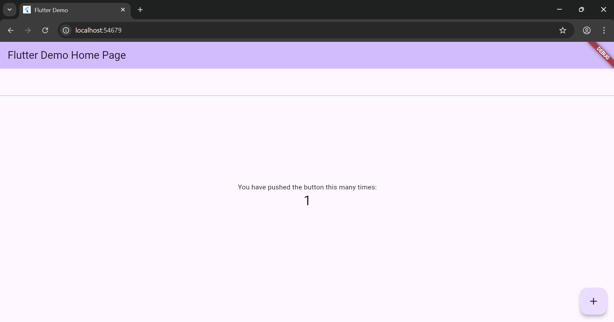

  # MediQueue – Smart Hospital Queue Management System

  ## 📱 Overview
  **MediQueue** is a mobile-first digital queueing system designed to modernize hospital appointment management in Tier-2/3 cities. It allows patients to join queues remotely and receive real-time updates, reducing crowding and improving hospital workflow.

  ## 🎯 Problem Statement
  Patients in many hospitals still experience:

  - Long waiting times  
  - Crowded waiting areas  
  - Inefficient patient flow management  
  - Lack of transparency in queue status  
  - Stress for both patients and staff  

  ## ✨ Solution
  MediQueue solves these issues by offering:

  - **Mobile-first queueing:** Join queues remotely  
  - **Real-time updates:** Live Firestore sync  
  - **Multi-channel notifications:** App alerts + SMS  
  - **Minimal infrastructure:** Only tablets required for hospitals  

  ## 🚀 Features

  ### **Patient Mobile App**
  - Simple registration (Name, Phone, optional Email)  
  - QR code scanner for hospital check-in  
  - Join queue by department  
  - Live queue position tracking  
  - Push notifications when turn is near  
  - Cancel queue option  

  ### **Hospital Admin Dashboard**
  - Real-time queue overview  
  - **Call Next Patient** button  
  - Mark patients as completed/no-show  
  - Manage counters  
  - Daily queue statistics  

  ## 🏗️ Technology Stack

  | Component | Technology |
  |----------|------------|
  | Frontend | Flutter |
  | Backend | Firebase |
  | Database | Firestore |
  | Auth | Firebase Authentication |
  | Notifications | Cloud Functions (SMS), Push Notifications |
  | Hosting | Firebase Hosting |
  | Languages | Dart, JavaScript |

  ## 📋 Prerequisites
  - Flutter SDK (>= 3.0.0)  
  - Firebase Project  
  - Android Studio / VS Code  
  - Android Device/Emulator (API 26+)  
  - Node.js (for Cloud Functions)  

  ## 🚀 Getting Started

  ### **1. Clone the Repository**
  ```bash
  git clone https://github.com/kalviumcommunity/Mediqueue.git
  cd mediqueue
  ```

  ### **2. Install Dependencies**
  ```bash
  flutter pub get
  ```

  ### **3. Firebase Setup**
  - Create Firebase project  
  - Add Android app  
  - Download `google-services.json` into `android/app/`  
  - Enable Phone Authentication  
  - Create Firestore database  
  - Deploy Cloud Functions  

  ### **4. Environment Configuration**
  Create a `.env` file:

  ```
  FIREBASE_API_KEY=your_api_key
  FIREBASE_AUTH_DOMAIN=your_auth_domain
  FIREBASE_PROJECT_ID=your_project_id
  ```

  ### **5. Run the App**
  ```bash
  flutter run
  ```

  ## 📱 App Flow

  ### **Patient Flow**
  1. Register using name + phone  
  2. Scan hospital QR or select nearby  
  3. Join department queue  
  4. Track real-time position  
  5. Receive turn notifications  
  6. Cancel if needed  

  ### **Hospital Flow**
  - View live queue  
  - Call next patient  
  - Update patient status  

  ## 🏗️ Project Structure
  ```
  mediqueue/
  ├── lib/
  │   ├── main.dart
  │   ├── models/
  │   │   ├── patient.dart
  │   │   ├── queue.dart
  │   │   └── hospital.dart
  │   ├── screens/
  │   │   ├── auth/
  │   │   ├── patient/
  │   │   └── admin/
  │   ├── services/
  │   │   ├── auth_service.dart
  │   │   ├── queue_service.dart
  │   │   └── notification_service.dart
  │   ├── widgets/
  │   └── utils/
  ├── functions/
  │   └── index.js
  └── web/
      └── admin dashboard
  ```

  ## 🔧 Firebase Configuration

  ### **Firestore Collections**
  - `hospitals` — hospital data & counters  
  - `queues` — active patient queues  
  - `patients` — registered patients  
  - `notifications` — notification logs  

  ### **Security Rules**
  ```javascript
  rules_version = '2';
  service cloud.firestore {
    match /databases/{database}/documents {
      // Add security rules here
    }
  }
  ```

  ## 📲 Build APK
  ```bash
  flutter build apk --release
  ```

  ## 🌐 Deploy Admin Dashboard
  ```bash
  flutter build web
  firebase deploy --only hosting
  ```

  ## 👥 Team Members
  - **Isaac Reji** — Product Lead & Firebase Specialist  
  - **Claudia Jerome** — Flutter Development Lead  
  - **Danushri** — UI/UX & Testing Lead  

  ## 📅 Development Timeline
  - **Week 1:** Foundation & Design  
  - **Week 2:** Core Development  
  - **Week 3:** Integration & Testing  
  - **Week 4:** Deployment & MVP Completion  

  ----

  # Flutter Setup Verification

  ## 📋 Setup Process
  - ✅ **Flutter SDK installed and added to PATH**
  - ✅ **Android Studio with Flutter/Dart plugins installed**
  - ✅ **Pixel 6 emulator created (Android 13)**
  - ✅ **First Flutter app built and running**

  ---

  ## 📸 Verification Screenshots

  ### **Flutter Doctor Output**
    
  _All checks passing — environment ready._

  ### **Running Application**
    
  _Default Flutter counter app running successfully on the emulator._

  ---

  ## 📝 Reflection
  The setup process was straightforward but required careful attention to system configurations.  
  The main challenges involved:

  - Setting up proper **PATH environment variables**
  - Accepting **Android licenses**  
  - Ensuring Android Studio plugins were installed correctly

  Once configured, the Flutter development environment worked smoothly.  
  The **hot reload** feature especially stood out — it will significantly speed up our development for the **MediQueue hospital queue management system**.

  This complete and verified setup ensures a consistent and reliable environment for the entire team to begin building and testing our Flutter application.

  ---

  # 📁 Project Structure & Design Approach

  ## 📂 Purpose of Each Directory

  - **lib/**  
    Contains all the Dart source code for the application.

  - **screens/**  
    Holds individual UI screens, separated by user roles such as patient and admin.

  - **widgets/**  
    Stores reusable UI components like buttons and cards to avoid code duplication.

  - **models/**  
    Defines data models such as Patient, Queue, and Hospital, representing the app’s core data structures.

  - **services/**  
    Contains business logic and Firebase-related operations like authentication, queue handling, and notifications.

  - **utils/**  
    Includes constants, theme colors, and helper functions used across the app.

  ---

  ## 🧩 How This Structure Supports Modular App Design

  This folder structure separates UI, business logic, and data models, making the codebase easier to understand, maintain, and scale. By isolating reusable widgets and services, new features can be added without impacting existing screens. This modular approach is especially useful for MediQueue as it will later integrate real-time Firebase updates and role-based workflows.

  ---

  ## 🏷️ Naming Conventions

  - **Files & folders:**  
    `snake_case.dart` for readability and consistency.

  - **Classes & widgets:**  
    `PascalCase` (e.g., `WelcomeScreen`, `PatientModel`).

  - **Variables & methods:**  
    `camelCase` following Dart best practices.

  - **Widgets:**  
    Named based on their responsibility (e.g., `PrimaryButton`, `AdminDashboardScreen`).


  # 📱 Responsive Welcome Screen – MediQueue

  ## 📌 Overview
  This screen demonstrates how responsive and adaptive user interfaces can be built in Flutter.  
  The **Welcome Screen** of **MediQueue** dynamically adjusts its layout, spacing, and text sizes to provide a consistent user experience across different screen sizes and orientations, including mobile phones and tablets.

  ---

  ## 🛠️ Responsiveness Implementation
  Responsiveness is implemented directly in `welcome_screen.dart` using **MediaQuery** and **LayoutBuilder**.

  ```dart
  final screenSize = MediaQuery.of(context).size;
  final isTablet = screenSize.width > 600;

  ```

  ## Flutter & Dart Fundamentals in MediQueue

  ### StatelessWidget vs StatefulWidget
  In MediQueue, StatelessWidget is used for static UI elements such as logos and labels, while StatefulWidget is used for dynamic components like live queue position and admin controls that update based on real-time data.

  ### Widget Tree & Reactive UI
  MediQueue follows Flutter’s widget tree structure where UI is composed of nested widgets. When queue data changes in Firestore, Flutter rebuilds only the affected widgets, ensuring smooth real-time updates.

  ### Why Dart is Ideal for MediQueue
  Dart provides strong typing, null safety, and async/await support, making it suitable for handling real-time data and maintaining application stability in MediQueue.

# 📱 Using Hot Reload, Debug Console, and Flutter DevTools Effectively

## 🧩 Project Title
Flutter Development Tools Demonstration

---

## 📖 Project Description
This project demonstrates the effective usage of **Flutter Hot Reload**, **Debug Console**, and **Flutter DevTools** to enhance development efficiency, debugging, and performance analysis.  
The demonstration was performed using an existing Flutter project from **Sprint-2**.

---

## ⚙️ Tools & Technologies Used
- Flutter SDK  
- Dart  
- Android Emulator / Physical Device  
- VS Code / Android Studio  
- Flutter DevTools  

---

## 🚀 Features Demonstrated

### 1️⃣ Hot Reload
Hot Reload allows developers to instantly apply code changes to a running Flutter application without restarting it or losing its current state.

**Steps Performed:**
1. Ran the Flutter app using `flutter run`
2. Modified a widget’s text or color
3. Saved the file
4. Observed immediate UI updates using Hot Reload

**Example Code Change:**
```dart
// Before
Text('Hello, Flutter!');

// After
Text('Welcome to Hot Reload!');

